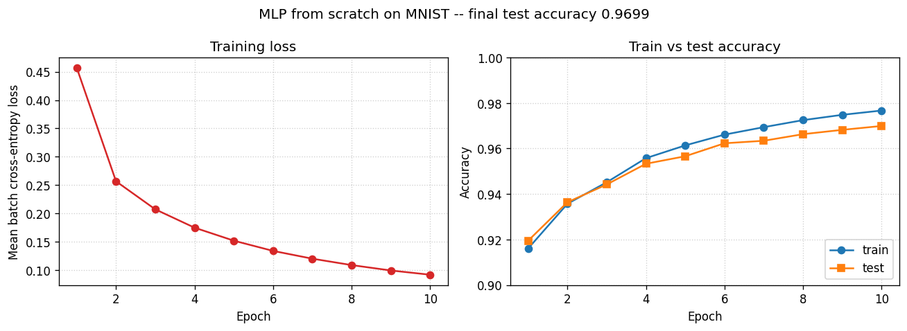

# Neural Network from Scratch — MNIST

A two-layer multi-layer perceptron trained on MNIST, implemented end-to-end
in plain NumPy. Forward propagation, backpropagation, and mini-batch SGD
are written out explicitly — no autograd, no PyTorch, no TensorFlow.

The point of building it from first principles is to make the maths visible:
the cross-entropy gradient and chain-rule expansion are derived by hand in
[`notes/backprop.md`](notes/backprop.md), and the code matches the derivation
line for line. The implementation is verified against centered-finite-difference
numerical gradients to machine precision (max relative error < 1e-7) before
training begins.

## Results

Default config: `hidden_dim=128`, `lr=0.1`, `batch_size=128`, 10 epochs,
`seed=42`. No momentum, no learning-rate schedule, no regularisation —
pure SGD on the cross-entropy of a two-layer MLP.



| Metric | Value |
|---|---:|
| Final test accuracy | **0.9699** |
| Final train accuracy | 0.9767 |
| Final mean-batch loss | 0.0922 |
| Train/test gap | 0.68% |

### Hidden layer width sweep

| `hidden_dim` | Test accuracy | Train accuracy |
|---:|---:|---:|
|  32 | 0.9595 | 0.9651 |
|  64 | 0.9638 | 0.9711 |
| **128** | **0.9699** | **0.9767** |
| 256 | 0.9723 | 0.9786 |

Test accuracy keeps improving with width but with diminishing returns
(+0.61% from 64→128, only +0.24% from 128→256). MNIST is small enough
that a 256-wide hidden layer can't fully exercise its capacity in 10
epochs of SGD.

### Learning rate sweep

| `lr` | Test accuracy | Train accuracy | Gap |
|---:|---:|---:|---:|
| 0.01 | 0.9232 | 0.9203 | -0.29% (still underfit) |
| 0.03 | 0.9459 | 0.9481 | 0.22% |
| 0.10 | 0.9699 | 0.9767 | 0.68% (default) |
| **0.30** | **0.9766** | 0.9908 | 1.42% (sweet spot) |
| 1.00 | 0.9755 | 0.9933 | **1.78%** (overfitting visible) |

Default `lr=0.1` sits just below the empirical sweet spot of 0.3. At
`lr=1.0` the train/test gap widens to 1.78% — classic SGD overfitting
signature.

## Architecture

```
input (784) -> Linear(784, 128) -> ReLU -> Linear(128, 10) -> softmax + cross-entropy
```

He-initialised weights (`std = sqrt(2/in_features)`), zero biases.
Softmax + cross-entropy combined for the clean `dL/dz = (p - one_hot(y)) / B`
gradient documented in [`notes/backprop.md`](notes/backprop.md) §4.

## How to run

```bash
git clone https://github.com/zaidanmir/mnist-nn-from-scratch.git
cd mnist-nn-from-scratch
python3 -m venv .venv
source .venv/bin/activate
pip install -r requirements.txt

# 10-epoch training (~30s on a laptop CPU)
python train.py

# Verify backprop with finite-difference numerical gradients
python -m src.gradcheck

# Reproduce the experiments
python -m experiments.hidden_size_sweep
python -m experiments.lr_sweep

# Run the unit tests
python -m unittest discover tests
```

A `Makefile` wraps the same commands: `make install`, `make train`,
`make gradcheck`, `make sweep`, `make test`.

The dataset (~11 MB across four IDX files) is downloaded automatically on
first run from the OSSCI MNIST mirror.

## Project structure

```
mnist-nn-from-scratch/
├── README.md
├── LICENSE
├── requirements.txt
├── train.py                            # CLI entrypoint
├── data/raw/                           # Downloaded IDX files (gitignored)
├── src/
│   ├── data.py                         # IDX loader, normalisation, batches
│   ├── layers.py                       # Linear (He init), ReLU
│   ├── losses.py                       # log_softmax + cross_entropy_loss
│   ├── model.py                        # MLP composing the primitives
│   ├── gradcheck.py                    # Finite-difference verification
│   └── train.py                        # train() loop + accuracy()
├── experiments/
│   ├── hidden_size_sweep.py            # 32 / 64 / 128 / 256
│   ├── lr_sweep.py                     # 0.01 / 0.03 / 0.1 / 0.3 / 1.0
│   ├── plot_curves.py                  # generates figures/training_curves.png
│   ├── hidden_size_results.csv
│   └── lr_results.csv
├── notes/
│   └── backprop.md                     # Hand-derived chain rule
├── tests/
│   └── test_pipeline.py                # 12 unit tests
└── figures/
    └── training_curves.png
```

## Implementation notes

- **No autograd, no PyTorch, no TensorFlow.** Pure NumPy throughout.
  `matplotlib` is used only for plotting; nothing in the model code imports
  outside numpy.
- **He initialisation** for ReLU compatibility. Default Xavier/Glorot init
  underestimates the variance correction needed when half the units are
  zeroed by ReLU; He's `std = sqrt(2/in_features)` doubles the variance to
  compensate.
- **Numerically stable softmax.** `log_softmax` subtracts the per-row max
  before exponentiating. Verified safe up to logits of magnitude ~1000
  (`log_softmax([1000,1001,1002])` evaluates without NaN).
- **1/B scaling at the loss layer.** Every downstream backward sees the
  mean-batch gradient, so SGD update is `θ -= lr * dL/dθ` with no
  per-batch rescaling needed in the optimiser.
- **Float64 gradient checking.** Parameters are upcast to float64
  in-place during `check_gradients()` so the centered finite-difference
  comparison isn't dominated by float32 cancellation noise. Achieves
  max rel err < 1e-7 across all parameters.

## References

- LeCun, Y. et al. (1998). *Gradient-based learning applied to document recognition.*
  The original MNIST paper.
- Glorot & Bengio (2010); He et al. (2015). The Xavier and He initialisation
  papers cited in `src/layers.py`.
- Bishop, *Pattern Recognition and Machine Learning* (2006), Chapter 5
  on neural networks for the standard textbook treatment.
